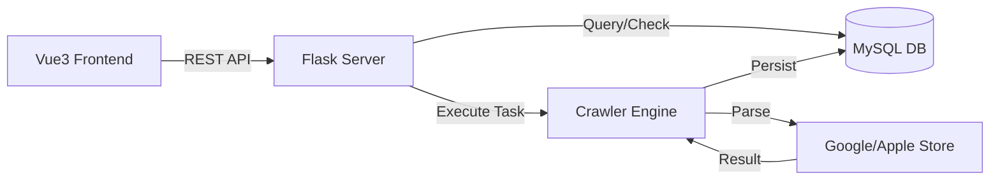

  

  <h1>App Landing Page Analyzer</h1>

  

    <strong>一款移动应用商店资源分析工具，助力市场运营一键解析竞品落地页素材与不同国家地区本地化策略。</strong>
  

  

    
    
    
    
  

  

    <a href="#-快速开始">快速开始</a> •
    <a href="#-核心特性">核心特性</a> •
    <a href="#-架构设计">架构设计</a> •
    <a href="./tutorials/README.md">深度教程</a>
  

---

## 核心特性

<table width="100%">
  <tr>
    <td width="50%" style="border: none; vertical-align: top;">
      <h3>全球化商店适配</h3>
      
内置 <strong>Region-Language</strong> 联动引擎，支持一键切换国家代码与语言偏好，深度捕获不同文化背景下的本地化商店素材，助力全球市场调研。

    </td>
    <td width="50%" style="border: none; vertical-align: top;">
      <h3>实时同步解析</h3>
      
采用<strong>双重请求架构</strong>：后端实时抓取配合数据库 7 天有效期校验。在保证素材新鲜度的同时，实现秒级响应，告别漫长的异步任务等待。

    </td>
  </tr>
  <tr>
    <td width="50%" style="border: none; vertical-align: top;">
      <h3>高保真链接清洗</h3>
      
针对 Google Play 复杂的 <code>srcset</code> 逻辑，系统自动剥离 <code>2x</code>、<code>512w</code> 等冗余描述符，直取 <strong>HD 原图链接</strong>，确保存储的每张素材均为最高清晰度。

    </td>
    <td width="50%" style="border: none; vertical-align: top;">
      <h3>多维可视化对比</h3>
      
基于 Vue3 构建 <strong>Icon-to-Screen</strong> 画廊。支持多包名、多地区的横向排版对比，让应用图标与截图的视觉差异一目了然，提升分析效率。

    </td>
  </tr>
</table>

---

## 架构设计

本项目采用前后端分离的**生产级架构**，确保了高并发场景下的稳定性。

## 快速开始

---

 
如果您觉得这个项目有帮助，请给一个 ⭐️
 
© 2026 Ivory Gate. Built with ❤️ for Marketing.
 
