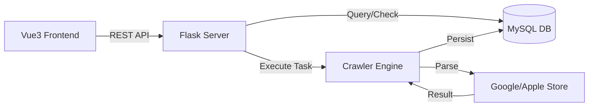

<div align="center">
  

  <h1>App Landing Page Analyzer</h1>

  <p align="center">
    <strong>一款移动应用商店资源分析工具，助力市场运营一键解析竞品落地页素材与不同国家地区本地化策略。</strong>
  </p>

  <p align="center">
    
    
    
    
  </p>
  <p align="center">
    <a href="#快速开始">快速开始</a> •
    <a href="#核心特性">核心特性</a> •
    <a href="#架构设计">架构设计</a> •
    <a href="./tutorials/project_design.md">详细信息</a> •
    <a href="./tutorials/api_interface.md">接口文档</a>
  </p>

</div>

<br />

## 核心特性

<div align="center">
  <table width="100%" style="border-collapse: collapse; border: none; margin: 20px 0;">
    <tr>
      <td width="50%" style="border-right: 1px solid #e1e4e8; border-bottom: 1px solid #e1e4e8; padding: 30px; vertical-align: top;">
        <div align="left">
          <p><b>全球化商店适配</b></p>
          <p style="font-size: 13.5px; line-height: 1.6; color: #586069;">
            内置 <b>Region-Language</b> 联动引擎，支持一键切换国家代码与语言偏好，深度捕获不同文化背景下的本地化素材，有效助力全球市场调研。
          </p>
        </div>
      </td>
      <td width="50%" style="border-bottom: 1px solid #e1e4e8; padding: 30px; vertical-align: top;">
        <div align="left">
          <p><b>实时同步解析</b></p>
          <p style="font-size: 13.5px; line-height: 1.6; color: #586069;">
            采用<b>双重请求架构</b>：后端实时抓取配合数据库 7 天有效期校验。在保证素材新鲜度的同时实现秒级响应，彻底告别漫长的异步任务等待。
          </p>
        </div>
      </td>
    </tr>
    <tr>
      <td width="50%" style="border-right: 1px solid #e1e4e8; padding: 30px; vertical-align: top;">
        <div align="left">
          <p><b>高保真链接清洗</b></p>
          <p style="font-size: 13.5px; line-height: 1.6; color: #586069;">
            针对 Google Play 复杂的 <code>srcset</code> 逻辑，系统自动剥离 <code>2x</code> 等冗余描述符，直取 <b>HD 原图链接</b>，确保存储素材均为最高清晰度。
          </p>
        </div>
      </td>
      <td width="50%" style="padding: 30px; vertical-align: top;">
        <div align="left">
          <p><b>多维可视化对比</b></p>
          <p style="font-size: 13.5px; line-height: 1.6; color: #586069;">
            基于 Vue3 构建 <b>Icon-to-Screen</b> 画廊。支持多包名多地区横向对比，让图标与截图的视觉差异一目了然，从交互层面大幅提升分析效率。
          </p>
        </div>
      </td>
    </tr>
  </table>
</div>

<br />

## 架构设计

本项目采用前后端分离的**生产级架构**，确保了高并发场景下的稳定性。



<br />

## 快速开始

1. **克隆项目**

```shell
git clone https://github.com/IvoryGate/land-page-analysis.git
```

2. **环境准备**

确保你的开发环境已安装以下组件：

```shell
mysql 9.6.0
python 3.14.2
node.js v24.11.1
```

3. **数据库配置**

登录 MySQL 并创建一个新的数据库：

```sql
CREATE DATABASE land_page_analysis DEFAULT CHARACTER SET utf8mb4;
```

后端服务首次启动时，`DBManager` 将自动初始化 `tasks` 与 `images` 表结构。

4. **后端部署**

进入后端目录并创建虚拟环境：

```shell
cd land-page-analysis-backend
python -m venv .myvenv
```

激活虚拟环境：

```shell
# Windows
myvenv\Scripts\activate
# Linux/macOS
source myvenv/bin/activate
```

安装依赖：

```shell
pip install -r requirements.txt
```

配置环境变量：

在`land-page-analysis-backend`目录下创建`.env`文件，参考`.env.example`配置数据库参数：
```shell
# --- 数据库配置信息 ---
HOST = "127.0.0.1"
PORT = 3306
USR = "root"
PASSWORD = "你的密码"
DATABASE = "你的数据库名"
CHARSET = "utf8mb4"

# --- 爬虫配置信息 ---
CRAWLER_MAX_WORKERS = 10
CRAWLER_TIMEOUT = 10

# --- Google Play Url 配置 ---
GOOGLE_URL = https://play.google.com/store/apps/details?id={0}&hl={2}&gl={1}

# --- Apple Store Url 配置 ---
APPLE_URL = https://apps.apple.com/{1}/app/id{0}?l={2}
```

6. **启动Flask服务**

```shell
# Windows
python app.py
# Linux/macOS
python3 app.py
```

服务默认运行在 [http://localhost:5050](http://localhost:5050)

**前端部署**

进入前端目录：

```shell
cd land-page-analysis-frontend
```

安装依赖：

```shell
npm install
```

启动开发服务器：

```shell
npm run dev
```

服务默认运行在 [http://localhost:5173](http://localhost:5173)

7. 一键启动脚本


---

<div align="center"> <p>如果您觉得这个项目有帮助，请给一个 ⭐️</p> <p>© 2026 Ivory Gate. Built with ❤️ for Marketing.</p> </div>
