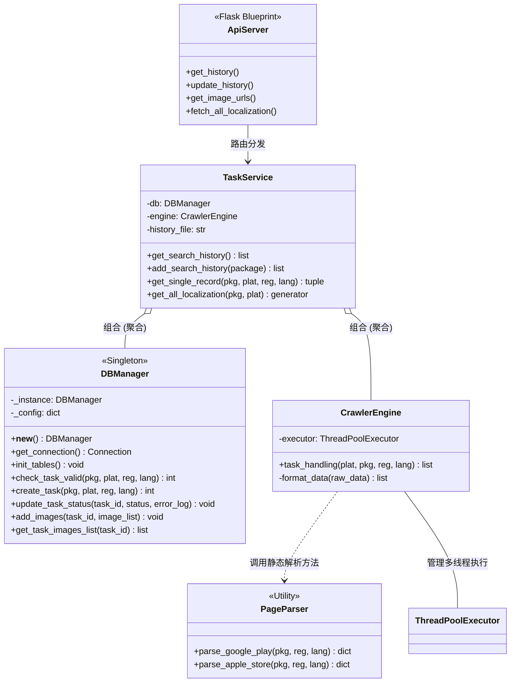

# 落地页分析工具设计文档

## 需求分析

### 1.1 核心功能需求

爬虫引擎：通过包名，地区，语言自动构建 URL，抓取应用在 Google Play 和 App Store 的落地页内容。

素材提取：精准识别并区分应用图标（Icon）与屏幕截图（Screenshots）。

多维度查询：支持单地区即时查询和全地区查询对比。

持久化存储：建立任务与图片的关联型数据库。

### 1.2 性能与可靠性需求

缓存机制：设置 7 天数据有效期，减少重复爬取，降低封禁风险，提高稳定性。

实时性：全地区对比采用流式数据传输，实现“即抓即显”的瀑布流效果。

高并发：利用多线程技术处理全地区同步抓取，提升响应速度。

### 1.3 交互界面需求

可视化看板：

​	提供“任务看板”和“地区对比”两种视图切换。

辅助输入：

​	输入包名时，系统需根据包名特征自动切换 GP/IOS 平台选项。

​	搜索框集成历史记录下拉列表，支持模糊匹配。

​	根据选择地区，自动匹配语言。

实时反馈：

​	在“全地区对比”时，页面需以“瀑布流”形式实时展现已完成的地区，避免长时间白屏。

​	按钮需具备 `loading` 状态，表格具备 `v-loading` 遮罩，避免重复操作。

响应式布局：

​	界面需适配不同分辨率，确保在宽屏下能并排展示多张截图，窄屏下自动折叠标签。（其实没怎么适配）

## 系统架构设计

系统采用前后端分离架构，确保爬虫逻辑、业务服务与 UI 展示的解耦。

### 2.1 后端设计

`crawler_engine.py` : 

​	负责维护 `ThreadPoolExecutor` 线程池。

​	接收业务层的抓取指令，分发给解析器，并对解析后的原始数据进行二次格式化。

`db_manager` : 

​	采用单例模式维护数据库连接。仅负责对数据库的增删改查，不处理任何网页解析逻辑，方便未来对接其他数据库。

`api_server` : 

​	负责路由管理、参数提取及 CORS 跨域配置。

​	不涉及业务逻辑，仅负责将 HTTP 请求转化为 Service 调用，并处理 `NDJSON` 流式响应。

`task_service` : 	

​	负责核心流程编排：检查缓存有效期 -> 调度爬虫 -> 存储结果。

​	管理本地 `search_history.json` 的读写。

`page_parser` : 

​	针对 Google Play 和 App Store 的 HTML 结构提供精准的 DOM 筛选。

​	负责处理网络请求头模拟、代理分配及正则表达式提取。



如果想要更换解析库，只需修改 `PageParser`；如果想要更换数据库，只需修改 `DBManager`，而核心业务逻辑 `TaskService` 始终保持不变。

### 2.2 前端设计

可视化界面，能够发送查询请求

能够展示对比不同包名国家落地页的图片

### 2.3 数据库设计

储存包名，国家，地区信息，以及对应的icon和其他图片的url

**任务列表（`tasks`）**

该表用于记录每一个抓取请求的元数据及其生命周期状态。通过 `package_name`、`region` 和 `language` 的复合索引优化查询速度。

| 字段         | 类型         | 约束/默认值                | 允许为空 | 描述                                            |
| ------------ | ------------ | -------------------------- | -------- | ----------------------------------------------- |
| id           | INT          | PRIMARY KEY, AUTO_INC      | 否       |                                                 |
| package_name | VARCHAR(255) | INDEX                      | 否       | 应用包名（建立索引）                            |
| platform     | ENUM         | 'google_play', 'app_store' | 否       | `google_play`, `apple_store`                    |
| region       | VARCHAR(10)  | INDEX                      | 否       | 地区代码（如 us, jp）                           |
| language     | VARCHAR(10)  | INDEX                      | 否       | 语言代码（如 zh,en)                             |
| status       | VARCHAR(20)  | DEFAULT 'pending'          | 否       | 状态: `pending`, `running`, `success`, `failed` |
| erro_log     | TEXT         |                            | 否       | 错误描述                                        |
| create_at    | DATETIME     | DEFAULT NOW()              | 否       |                                                 |
| update_at    | DATETIME     | DEFAULT NOW()              | 否       |                                                 |

**图片资源表`Images`**

该表通过外键与 `tasks` 关联，存储提取后的素材 URL。一对多关系（一个 Task 对应一个 Icon 和多个 Screenshots）。

| 字段       | 类型 | 约束/默认值           | 允许为空 | 描述           |
| ---------- | ---- | --------------------- | -------- | -------------- |
| id         | INT  | PRIMARY KEY, AUTO_INC | 否       |                |
| task_id    | INT  | FOREIGN KEY           | 否       | 关联tasks.id   |
| Image_type | ENUM | 'icon', 'other'       | 否       | `icon`,`other` |
| url        | TEXT |                       | 否       | 图片链接       |

### 2.4 日志系统设计

还没有

## 文件架构设计

```shell
.
├── land-page-analysis-backend        # 后端工程目录 (Python / Flask)
│   ├── app.py                        # 程序主入口，负责初始化 Flask 与注册蓝图
│   ├── config.py                     # 全局配置文件：数据库连接、爬虫阈值、UA池等
│   ├── core                          # 后端核心逻辑包
│   │   ├── api_server.py             # 接口路由层：定义 API Endpoints 与 NDJSON 流响应
│   │   ├── crawler_engine.py         # 并发引擎层：管理 ThreadPoolExecutor 线程池
│   │   ├── db_manager.py             # 持久化层：基于单例模式的 MySQL 增删改查封装
│   │   ├── page_parser.py            # 解析层：针对 GP/AppStore 的 HTML 解析策略
│   │   └── task_service.py           # 业务逻辑层：调度缓存检查、爬虫触发与结果加工
│   ├── logs                          # 日志目录：存放爬虫异常及系统运行日志（但是还没有写）
│   ├── requirements.txt              # 后端依赖清单 (Flask, BeautifulSoup, PyMySQL 等)
│   ├── search_history.json           # 本地持久化文件：存储最近 10 条搜索历史记录
│   └── utils                         # 工具包
│       └── logger.py                 # 日志模块封装：统一日志格式与输出流（还没有写）
│
├── land-page-analysis-frontend       # 前端工程目录 (Vue 3 + Vite)
│   ├── index.html                    # 单页面应用入口，配置了 no-referrer 策略
│   ├── package.json                  # 前端依赖配置及脚本命令 (dev, build)
│   ├── src                           # 源代码目录
│   │   ├── main.js                   # 前端启动入口：挂载 Vue 实例与 Element Plus
│   │   ├── App.vue                   # 核心视图组件：包含看板切换、流式渲染逻辑及样式
│   │   ├── components                # 公共组件目录 (如图片卡片、状态标签等)
│   │   └── assets                    # 静态资源目录 (图片、样式文件)
│   └── vite.config.js                # Vite 构建配置文件：处理代理、路径别名等
│
├── README.md                         # 项目总述文档
├── start.ps1                         # Windows PowerShell 启动脚本：一键启动前后端
├── start.sh                          # Linux/macOS 启动脚本
└── tutorials                         # 项目系列教程文档
    ├── api_interface.md              # 接口详述：参数说明与流式协议规范
    ├── error_manage.md               # 错误码手册及异常处理指南
    └── project_design.md             # 设计文档：架构、UML、数据库表结构
```

